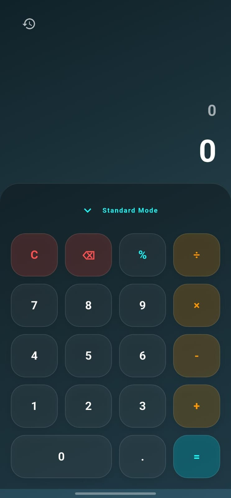
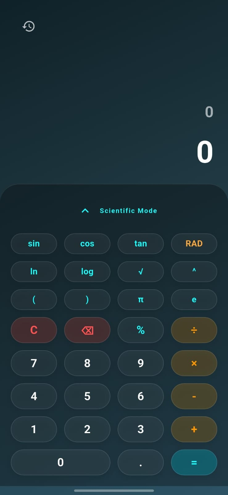
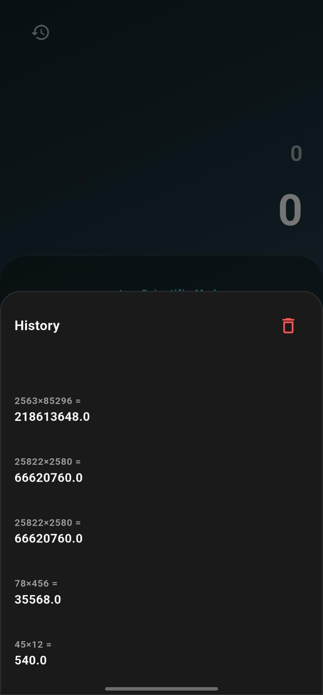

# mycalc -  Calculator


A modern,  scientific calculator built with Flutter.

## ✨ Features

- **UI**: Iconic design with circular buttons, dark mode, and glassmorphism elements.
- **Scientific Mode**: Advanced mathematical functions including Trigonometry (sin, cos, tan), Logarithms (log, ln), Roots, and Exponents.
- **History Tracking**: Persistent history of calculations using Hive local database.
- **Robust Math Engine**: Powered by `math_expressions` for accurate parsing and evaluation.
- **Responsive**: Adaptive layout that looks great on all screen sizes.

## 📸 Screenshots

| Standard Mode | Scientific Mode | History |
|:---:|:---:|:---:|
|  |  |  |

## 🚀 Getting Started

### Prerequisites
- Flutter SDK (3.0+)
- Dart SDK

### Installation

1. **Clone the repository**
   ```bash
   git clone https://github.com/yourusername/mycalc.git
   cd mycalc
   ```

2. **Install dependencies**
   ```bash
   flutter pub get
   ```

3. **Run the app**
   ```bash
   flutter run
   ```

## 📱 Building for Production

### Android Play Store
1. **Generate App Icon**
   ```bash
   dart run flutter_launcher_icons
   ```

2. **Sign the App**
   - Create a `key.properties` file in `android/` with your keystore details.
   - Refer to `android/app/build.gradle.kts` for configuration.

3. **Build App Bundle**
   ```bash
   flutter build appbundle
   ```
   The output will be in `build/app/outputs/bundle/release/app-release.aab`.

## 🛠️ Tech Stack

- **Framework**: Flutter
- **Language**: Dart
- **State Management**: `setState` (Simple & Efficient)
- **Database**: Hive (NoSQL)
- **Math Logic**: `math_expressions`

## 📄 License

This project is licensed under the MIT License - see the [LICENSE](LICENSE) file for details.
